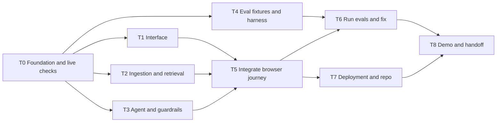

# Full-stack document Q&A agent: build plan and tickets

## Outcome

Build a small working app for an employee who needs answers from an internal handbook. Today they search and read documents manually. The app accepts documents, indexes their contents, and answers questions using retrieved passages, with citations that open the source text.

Example demo: upload a fictional employee handbook, ask “What do I need to do before requesting reimbursement?”, and receive a grounded answer with the relevant policy passages. Ask something absent from the handbook and receive an honest explanation that the documents do not answer it.

Success means the complete journey works through the browser with a real embedding provider, vector database, and language model. Mocks support parallel development but do not count as the final integration.

## Scope and assumptions

- Interview budget: 150 minutes. This repository starts empty.
- Required: frontend, ingestion, embeddings, vector DB, RAG, runtime guardrails, small eval suite, traces, working deployment, reproducible setup, repository handoff, and business visual.
- First supported formats: UTF-8 `.txt` and `.md`; maximum 1 MB/file, five documents per session. PDF extraction is a stretch ticket. The UI states the supported formats.
- Use fictional, non-sensitive demo documents. Separate browser sessions must not retrieve one another's content.
- Conversation memory: at most six previous messages from the current browser session; clear it with “Start new conversation.” Documents stay available for that session. No long-term personal memory.
- A single bounded application workflow is sufficient. Multiple development instances can build independent tickets; multiple autonomous agents inside the app are unnecessary.
- Local deployment satisfies the brief. Cloud deployment is a target after the first working vertical slice.

## Architecture and decision log

| Choice | Purpose | Tradeoff |
| --- | --- | --- |
| Next.js frontend + Fastify API, both TypeScript | Two independently deployed Railway services with shared request/response types | Requires explicit service routing and two startup commands; ingestion remains small and bounded |
| LangChain JS behind small application interfaces | Chunking, model calls, retrieval orchestration | Wrap library types so UI and API contracts remain independent of the library |
| OpenRouter embedding and chat adapters | Server-side access to model providers; follows the preparation direction | Verify actual model availability, dimensions, limits, and structured output in ticket T0 |
| Zilliz Cloud | Persist embeddings and chunk metadata; retrieve source passages | Credentials and collection setup are prerequisites; session filters must apply to every operation |
| Dense + BM25 hybrid retrieval with RRF | Match both meaning and exact policy terms | Validate collection support early; dense search is the first integration milestone |
| LangSmith | Trace stages and record eval runs | Separate server-side key; only fictional demo data goes into traces |
| Railway target; local startup required | Deliver a shareable app plus a reproducible fallback | Cloud deployment depends on credentials and persistent service connectivity |

Next.js supports external URL rewrites for proxying API requests ([docs](https://nextjs.org/docs/app/api-reference/config/next-config-js/rewrites)). Railway supports shared monorepo deployments ([docs](https://docs.railway.com/deployments/monorepo)) and private service networking ([docs](https://docs.railway.com/networking/private-networking)). Zilliz documents dense/BM25 hybrid retrieval and RRF ([hybrid search](https://docs.zilliz.com/docs/hybrid-search), [rankers](https://docs.zilliz.com/docs/hybrid-search-rankers)). LangSmith supports offline evaluation against defined datasets ([evaluation docs](https://docs.langchain.com/langsmith/evaluation-types)). These choices still require live checks; no provider integration has been tested yet.

Do not require a second relational database for this scope. Store source text and citation metadata alongside chunks in the vector collection. A signed, HTTP-only cookie identifies a random server-generated workspace. Never accept a workspace ID supplied in a request body.

### Ingestion path

Upload → validate file/count/size → decode text → split into chunks → embed chunks → insert text, vectors, and metadata → report indexed status.

Start with approximately 800-token chunks and 120-token overlap, preserving headings when practical. Record chunk order and line spans so citations can be checked. This is a baseline to evaluate, not an optimized setting. Reject empty text. On partial ingestion failure, remove partial chunks and return a retryable error; a document is selectable only when indexing has completed.

Collection fields: `workspaceId`, `documentId`, `chunkId`, `documentName`, `text`, `startLine`, `endLine`, `chunkIndex`, `embedding`, and BM25-generated sparse representation. Vector dimensions must come from a real embedding response and remain consistent. Set up the collection once, outside request handling.

### Answer path

Question → schema/length checks → LLM request guard → retrieve within session and selected documents → fuse ranked results → supply up to six passages → generate structured draft → validate citation IDs and run LLM grounding/output guard → return answer and source excerpts, or a clear abstention.

Use previous messages to resolve follow-up questions, but retrieve evidence for each answer. History and document text are untrusted input. They cannot change system instructions, workspace filters, or available tools.

One request guard, one generation call, and one output guard; no open-ended agent loop. Allow one structured-output repair within the overall timeout. Bound retrieval context and output tokens. No external side-effect tools. An outage in a required guard must fail closed with a retryable error.

No fixed similarity-score threshold is assumed to work across dense and hybrid search. Initially abstain when there are no passages or when the grounding check finds insufficient support. Inspect retrieval failures in evals before tuning thresholds or adding semantic reranking.

## Railway deployment: two services

Use one npm-workspaces repository:

```text
apps/web/            Next.js frontend and /api proxy
apps/api/            Fastify API, ingestion, RAG, guards
packages/contracts/ Shared types and validation schemas
```

Create `web` and `api` services from the same GitHub repository in the same Railway project/environment. Keep both service root directories at the repository root so shared contracts are available. Configure distinct workspace build/start commands; do not rely on automatic monorepo service detection.

| Setting | web | api |
| --- | --- | --- |
| Build command | `npm ci && npm run build --workspace @document-qa/web` | `npm ci && npm run build --workspace @document-qa/api` |
| Start command | `npm run start --workspace @document-qa/web` | `npm run start --workspace @document-qa/api` |
| Port | Explicit `PORT=3000` | Explicit `PORT=4000` |
| Bind | `0.0.0.0` for public frontend | `::` for private IPv4/IPv6 connectivity |
| Public domain | Generate Railway domain here | No public domain needed |
| Health path | `/health` | `/api/health` |
| Variables | `BACKEND_URL` only, plus its port | Provider credentials, model IDs, session secret, `APP_ORIGIN`, and its port |

Planned package scripts must implement those commands. API builds compile TypeScript; frontend builds run Next.js. Shared contracts are source exports consumed by both builds; backend compilation must emit the required shared code. The current scaffold is a single Next.js app; moving it into this two-service layout is still required. Railway deployment has not been verified here.

Browser → public `web` → `/api/*` rewrite → private `api` → Zilliz/OpenRouter/LangSmith. Set frontend `BACKEND_URL=http://${{api.RAILWAY_PRIVATE_DOMAIN}}:${{api.PORT}}`. The browser always requests relative `/api/...` URLs; private Railway DNS is resolved by the frontend server. Next.js owns presentation and request forwarding; all application API logic lives in Fastify.

Set backend `APP_ORIGIN` to the frontend's actual public HTTPS origin. Validate mutation origins there. The API issues host-only, HTTP-only session cookies through the frontend proxy; use Secure in production and SameSite=Lax. Verify cookie forwarding, uploads, response size, and timeout behavior through the public entry point. No browser-facing provider keys or `NEXT_PUBLIC_` secrets.

`BACKEND_URL` must be configured before the Next.js build because rewrite configuration can be captured during build. Builds must not call the private API or require provider connectivity. Rebuild the frontend if its rewrite destination changes. Configure watch paths for each app plus shared contracts and the root lockfile so shared changes redeploy both services.

Local defaults: frontend `http://localhost:3000`, API `http://localhost:4000`. Local API startup reads `API_PORT=4000`; production API startup reads Railway `PORT`. Root `.env` is local configuration input; scaffold scripts must explicitly load it for the API and Next.js configuration. Railway variables are configured per service, not supplied by committing `.env`. No persistent Railway volume is needed for this scope: indexed passages live in Zilliz, chat memory is bounded browser state, and signed cookies identify workspaces.

## Shared contracts: freeze before parallel implementation

Parent owns `packages/contracts/`, root configuration, dependencies, Fastify API routes, frontend proxy configuration, and integration. All implementation lanes consume these interfaces without modifying them. Changes come back to the parent.

```ts
type DocumentSummary = {
  id: string;
  name: string;
  chunkCount: number;
};
type Citation = {
  id: string;             // chunk ID; verified against retrieved passages
  documentId: string;
  documentName: string;
  excerpt: string;
  startLine: number;
  endLine: number;
};
type AskRequest = {
  question: string;       // 1–2,000 characters
  documentIds: string[];  // 1–5; server verifies session ownership
  history: { role: 'user' | 'assistant'; content: string }[]; // max 6
};
type AskResponse = {
  status: 'answered' | 'needs_clarification' | 'insufficient_evidence' | 'blocked';
  answer: string;
  citations: Citation[];
  requestId: string;
};
type ApiError = {
  error: { code: string; message: string; retryable: boolean };
  requestId: string;
};
```

- `POST /api/documents`: multipart `file`; returns `201 { document: DocumentSummary }` after indexing. MVP uses request/response ingestion, with immediate UI progress feedback.
- `GET /api/documents`: returns `{ documents: DocumentSummary[] }` restricted to the cookie's workspace, grouping indexed collection records by document.
- `POST /api/ask`: accepts `AskRequest`; returns `AskResponse` or `ApiError`.
- `GET /api/health`: basic application readiness, without secrets or document content.
- `ingestDocument({ workspaceId, name, text }): Promise<DocumentSummary>`.
- `retrieve({ workspaceId, documentIds, query }): Promise<Citation[]>`.
- `answerQuestion({ workspaceId, ...request }): Promise<AskResponse>`.
- Validation schemas live next to the shared types. Error mapping and cookie verification live in routes. Service code receives verified server context.
- Server-only configuration: provider key, embedding model, chat model, Zilliz endpoint/token/collection, LangSmith key/project, and session signing secret. Commit names and examples only.

## Frontend specification

One workspace screen. Desktop: narrow document panel on the left, question and answer area on the right. Mobile: document panel above questions. Restrained typography, clear contrast, visible keyboard focus, and labels on every input. No separate dashboard or settings screen.

Exact initial copy:

- Title: “Ask your documents”
- Description: “Upload a handbook or guide, then ask a question. Answers include passages you can check.”
- Upload button: “Upload document”
- Upload hint: “TXT or Markdown · up to 1 MB per file · up to 5 documents”
- Empty document list: “Add a document to get started.”
- Question label: “What would you like to know?”
- Question placeholder: “What do I need to do before requesting reimbursement?”
- Submit button: “Ask”
- Sources label: “Sources”
- Conversation reset: “Start new conversation”

States: empty, uploading/indexing, document ready, answering, answered, needs clarification, insufficient evidence, blocked, and recoverable error. During ingestion show “Indexing document…”; during answer show “Finding an answer…”. Disable duplicate submissions. Keep the question after failure and provide “Try again.” No invented progress percentage. Sources expand to show document name, line span, and exact excerpt. Announce loading and results to assistive technology.

## Ticket graph and parallel lanes



With three implementation lanes plus a coordinator: UI, data, and agent work concurrently. Coordinator writes eval fixtures, owns routes/configuration, deploys early, and integrates. Tickets describe future parallel work; this plan does not launch development instances.

### T0 — Foundation, interfaces, and live provider checks

Owner: coordinator. Budget: minutes 0–15. Boundaries: root scaffold/configuration, `packages/contracts/`, sample fixtures, service interface stubs, `.env.example`.

Tasks: approve business scope; create two-app npm-workspaces scaffold with shared contracts; freeze contracts; install shared dependencies once; add fictional handbook; perform one embedding call, vector insert/search/delete, chat structured response, and trace submission; record verified model ID/dimensions and setup steps. Establish worktrees based on this shared foundation before concurrent writers start.

Acceptance: both services start locally, frontend proxy reaches API, types compile, fixture responses cover all UI states, and provider checks have recorded outcomes. Missing credentials are explicit blockers to live integration. Implementations can use clearly marked development fixtures while those blockers are resolved.

### T1 — Usable frontend against the contract

Owner: UI lane. Budget: minutes 15–55. Boundaries: `apps/web/src/components/`, `apps/web/src/app/page.tsx`, UI stylesheet. Depends on T0.

Tasks: implement the specified screen and exact copy; upload/select documents; question submission; all loading/error/result states; expandable sources; bounded session history and conversation reset. Use a supplied API client with interchangeable fixture/live transport.

Acceptance: the entire flow can be demonstrated with fixtures; mobile layout works; keyboard navigation works; errors preserve input; source excerpts are inspectable. No changes to endpoints, schemas, shared dependencies, or agent logic.

### T2 — Real ingestion, embeddings, and retrieval

Owner: data lane. Budget: minutes 15–65. Boundaries: `apps/api/src/documents/`, `apps/api/src/retrieval/`, `apps/api/scripts/setup-vector-store.ts`. Depends on T0.

Tasks: implement chunking/line metadata, embedding batches, collection schema, indexed document listing, ingestion cleanup, dense retrieval, then BM25 + RRF; enforce workspace/document filters in the adapter; return contract citations.

Acceptance: a live uploaded handbook produces stored vectors; exact-term and paraphrase queries return relevant passages; another workspace gets no matches; partial failure leaves no ready document. Record the retrieval strategy actually used. No new formats or database services without coordinator approval.

### T3 — Bounded RAG workflow and guardrails

Owner: agent lane. Budget: minutes 15–65. Boundaries: `apps/api/src/agent/`, `apps/api/src/guardrails/`. Depends on T0; develop against fixture retrieval until T2 integrates.

Tasks: implement request guard, follow-up resolution, retrieved-context prompt, structured generation, citation validation, grounding/output guard, one bounded repair, timeout handling, and trace spans. Validate each guard's structured output too.

Acceptance: grounded fixture answer cites only supplied passages; ambiguity asks for clarification; absent facts abstain; instructions inside documents cannot override the workflow; provider failures return controlled errors. Verify the citations support the answer, not merely that their IDs exist. No autonomous loops, side-effect tools, or UI changes.

### T4 — Evaluation dataset and harness

Owner: coordinator while T1–T3 run. Budget: minutes 20–55. Boundaries: `evals/`, `scripts/evaluate.ts`. Depends on T0; execution waits for T5.

Tasks: define expected behavior before running checks; produce eight cases: direct fact, paraphrase, exact policy term, ambiguous request, missing information, document injection, fabricated-citation attempt, and cross-session access. Add a controlled provider-outage check separately. Include expected source chunk/line anchors where applicable.

Acceptance: runnable command produces per-case observed status, retrieved source IDs, citation validity, grounding review, latency, and pass/fail; use deterministic checks plus human review, with an LLM judge as additional evidence. Capture LangSmith experiment IDs when available. Cross-session checks must exercise actual retrieval/API boundaries.

### T5 — Integrate the complete browser workflow

Owner: coordinator. Budget: minutes 60–90. Boundaries: API routes, `apps/api/src/session.ts`, API client wiring, integration fixes agreed with lane owners. Depends on T1–T3.

Tasks: Fastify endpoints and Next.js proxy configuration; signed session cookies; request schemas; upload/count limits; origin validation on mutations; per-session request limits; error mapping; real adapters; bounded history handling; live end-to-end upload → question → answer → source expansion. Delete mock bypasses from production execution.

Acceptance: browser uses real providers and vectors; answer matches the handbook; citation text matches indexed text; refresh lists session documents; new session cannot list or retrieve them; failure path allows retry. No API keys appear in browser assets or repository.

### T6 — Run evals and fix the important failures

Owner: coordinator, assigning bounded fixes to existing lanes if needed. Budget: minutes 90–115. Depends on T4/T5.

Tasks: run the defined suite against live services, inspect traces, classify ingestion/retrieval/generation/guard failures, and fix high-impact issues. Compare dense and hybrid retrieval on the same questions if time permits. Add semantic reranking only if results justify it.

Acceptance: report all observed results and limitations. Demo gate: correct normal answer with supporting citation; honest abstention; injection handling; no cross-session leakage; controlled provider error. An aggregate score cannot hide a failed isolation or grounding gate.

### T7 — Deployment and repository handoff

Owner: coordinator. Budget: early local boot at minute 15, cloud skeleton attempt by minute 40, final verification minutes 105–130. Depends on T0 for skeleton, T5 for final deployment.

Tasks: independent workspace startup/build scripts, environment template, README, two Railway service configurations if accessible, both health checks, private routing, service-scoped secrets, clean Git review, GitHub repository readiness. Keep deployment files owned by the coordinator to avoid root-config conflicts.

Acceptance: fresh setup works from documented steps; both production builds pass; frontend-to-private-API routing and cookies work; deployed entry point completes the real journey; absent configuration produces useful setup errors. If cloud access is unavailable, deliver and verify local startup and report that limitation. Remote publishing happens when repository/account access is available and authorized.

### T8 — Business visual and final demo

Owner: coordinator. Budget: minutes 130–150. Depends on T6/T7.

Tasks: prepare one plain-language visual: “Searching a handbook” → “Upload and ask” → “Answer with passages to check”; rehearse a normal answer, absent-information case, and trace walkthrough. Record known limits and explain key code paths.

Acceptance: app URL/startup command, repository, decision log, eval report, and visual are ready. Benefits are illustrative unless measured. Explain development parallelism separately from the application's bounded RAG workflow.

## Integration rules

- One writer per worktree. Give each lane a checkout path, allowed paths, contract version, approved copy, acceptance checks, and non-goals.
- Coordinator owns lockfile, root config, contracts, routes, scope, and final review. No lane adds dependencies or changes interfaces independently.
- Each lane returns changed paths, checks actually run, unresolved decisions, and limitations. Coordinator reviews the actual diff and integrates deliberately.
- Integrate the first working slice early; do not wait for every optional feature. No ongoing worker edits in an integrated checkout.

## Time cuts and unresolved setup

Preserve real embeddings/vector search, grounded answers/citations, runtime guards, evals, browser flow, and local deployment. Cut PDF support, streaming, semantic reranking, accounts, document deletion UI, durable chat history, and visual polish beyond a usable interface first.

If hybrid setup is still blocked at minute 60, integrate dense retrieval and document the missing BM25 path while continuing a bounded fix. Do not substitute fixture vectors or answers for a claimed live result.

Before implementation, resolve server-side credentials/access for the chosen model provider, Zilliz, and LangSmith; confirm cloud/GitHub destination if publishing. The referenced `core-rag-plan.md` and `vector-db-setup.md` were not included in the supplied attachment or empty repository, so their additional details have not been assumed.
