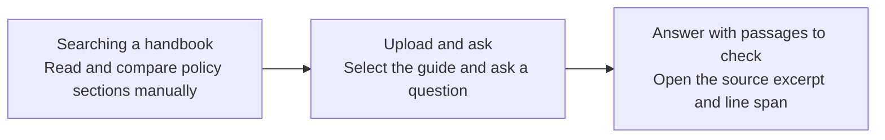

# Document Q&A journey

Example (fictional): “What do I need to do before requesting reimbursement?” → manager's written approval and an itemized receipt → inspect the expense policy passage.

If the answer is absent, the app says the documents do not answer the question. Time savings are illustrative, not measured.

The application's workflow is bounded: request guard → retrieval → answer draft → grounding guard. Development subagents are separate implementation workers, not autonomous agents in the application.
